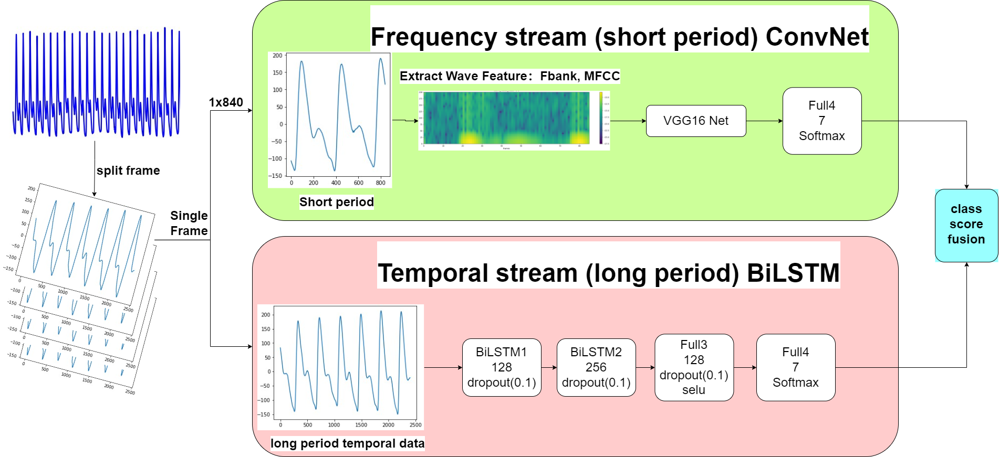
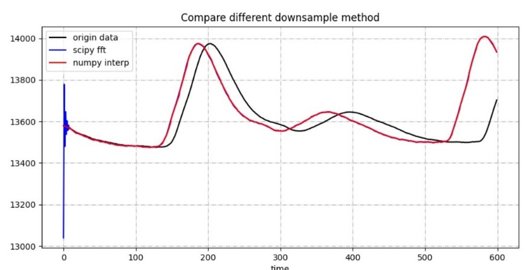
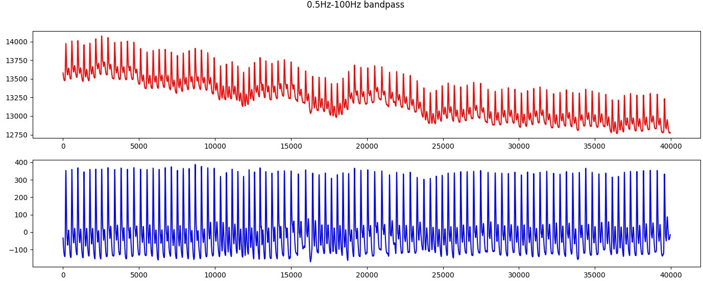
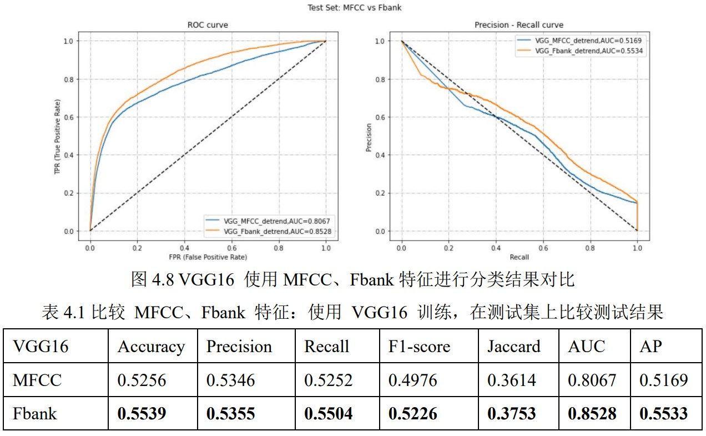
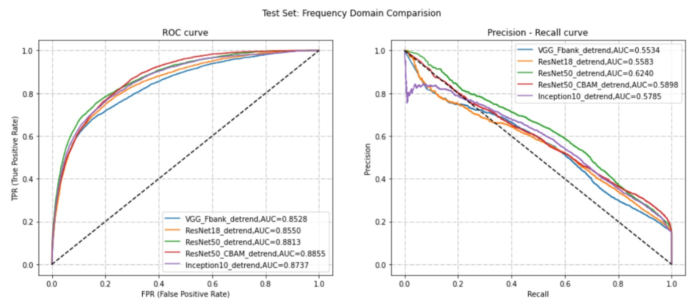
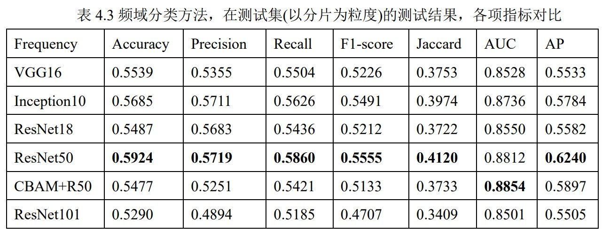
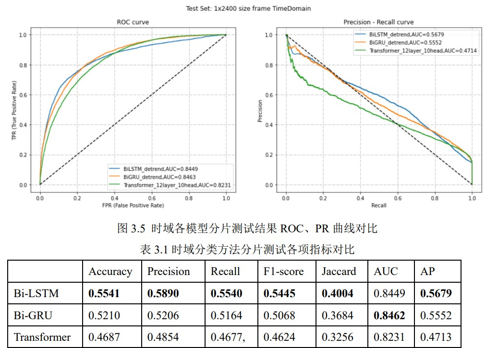
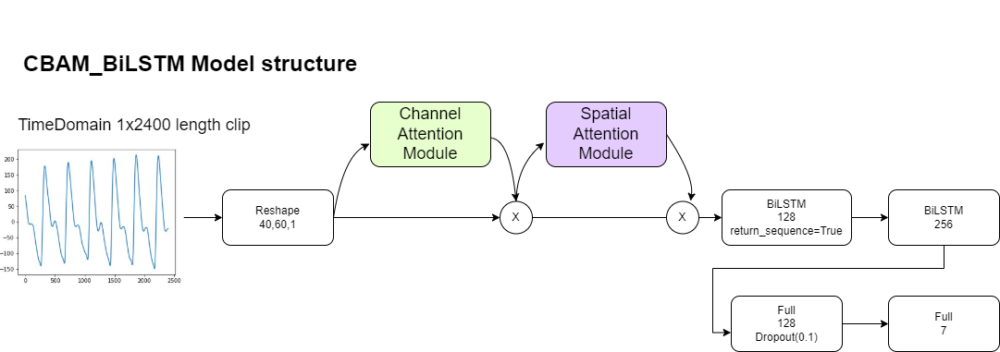
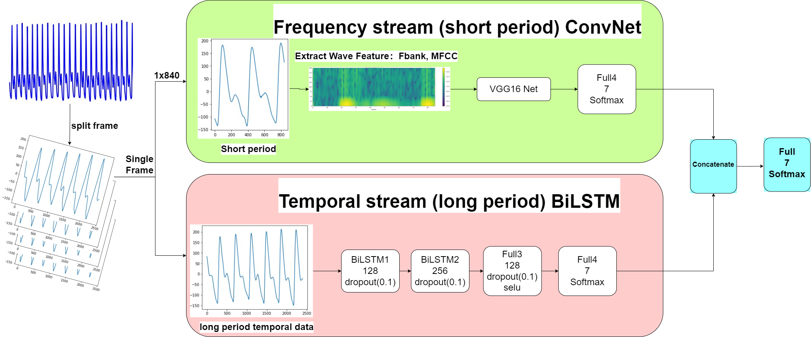
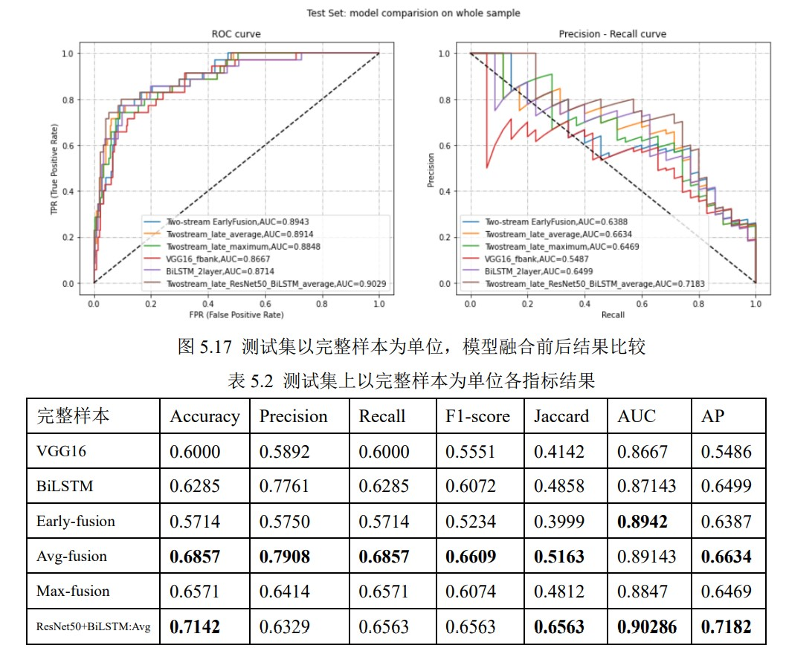

# Two-stream Model in Pulse-classification :fire::watermelon:

> This project was my **Final Project of Undergraduate** :swimmer:
> Multi-feature based pulse wave classification 
> author: Loki Xun



**Enlightened by `Two-stream CNN` in video action recognition field, we apply this thought to the wave classification task.**  Designing the similar frame concept by clipping the wave data within certain length, we introduce the `Two-stream` Model in pulse wave classification，which is compose of Frequency and Time Stream. 

**For frequency stream** :beer:
 we convert 1D wave data into `Fbank` feature (2D matrix)，and thus convert the wave classification to the image classification task. And we employ the ResNet50 as our frequency stream's model.

**For Time stream** :watch:
we directly convert 1D wave data(1x2400 length data) into RNN input shape (batchsize, 40,60), and use BiLSTM and Transformer Encoder to classify.

**For the fusion part,** we have tried 2 methods: 

- late-fusion :+1:
  Fuse two-stream model's softmax output (1x7 embedding) with certain Rule， like **Average**、Maximum、Add

- early-fusion

  two-model's output, continue to infer forward by one Dense Layer to get the output.


## Data Preprocessing

原始共 7 类脉诊数据，分别对应不同脉象，每一类样本为 1D 波形数据（幅值）以 txt 形式存储；
	每例数据采集时间为60s，这期间包含多个完整周期，**对数据进行截取，得到多个单个完整周期，作为本次实验所需的数据集**

```{"滑脉": 0,"平脉": 1,"实脉": 2, "细脉": 3,"细弦脉": 4,"弦滑脉": 5,"弦脉": 6}```

- 采样数据

  - 采样时间：共 998 个样本，采样时间长度：899 个为 60s，99 个为 6s；

  - 采样率 sample rate

    90% 样本采样率在 724 Hz，最小采样率为 666.13 Hz：1 个，最大采样率 730.67Hz 3 个

  - 采样压力：分布不均。

  

- 时序数据截取，得到单个周期采样点，作为训练数据

###  train-test split

所有 7 类样本区分为：train 训练集、validate 验证集、test 测试集

- test 集合选取：由于每一类样本太少，为使得测试结果有更高可信度：从每一类种选取 5 个样本加入 test 集合
- 剩下数据，在分片后，选择 90% 的分片作为 train，10% 的分片作为 validate 集合数据


#### tips：如何分割 train、validate、test

> [参考](https://towardsdatascience.com/how-to-split-data-into-three-sets-train-validation-and-test-and-why-e50d22d3e54c#:~:text=Definition%20of%20Train-Valid-Test%20Split%20Train-Valid-Test%20split%20is%20a,given%20dataset%20and%20divide%20it%20into%20three%20subsets.) :+1:
> [抽取 train、test 数据参考](https://blog.csdn.net/sinat_29957455/article/details/83793601)

- **Why do you need to split data?**

  We don’t want our model to over-learn from training data and **perform poorly after being deployed in production**. 

  - Train Dataset

    ​	用于 fit 模型的数据

  - Valid Dataset

    - Set of data used to provide an unbiased **evaluation of a model fitted on the training dataset** :star:while tuning model hyperparameters.

    - Also play a role in other forms of model preparation, such as feature selection, threshold cut-off selection.

  - Test Dataset

    - Set of data used to provide an unbiased **evaluation of a final model** fitted on the training dataset.

​	训练集是用来训练模型的，通过尝试不同的方法和思路使用训练集来训练不同的模型，再通过**验证集使用交叉验证来挑选最优的模型**，通过不断迭代来改善模型在验证集上的性能，最后再通过测试集来评估模型的性能。如果**训练集和测试集数据不在同一个分布中**，那么模型在测试集上的表现肯定是不会理想。

- 最佳划分数据集方式

  ​	先将各类的数据都打乱混合在一起，然后再将数据集分为训练集、验证集和测试集，这样就能保证它们都处于同一分布中。

  

  

  

### Unify Sample Rate

> [参考](https://blog.csdn.net/baidu_38963740/article/details/121698370)

#### 重采样方法比较

实验采用单个周期的波形数据，例如取 400 个采样点作为一个周期数据，需要统一采样率

- 均匀降采样：直接等间隔抽取，采样率降低，可能出现不满足采样定理的情况！

  > *即抽取后的离散信号中会出现“混叠”*

  ```
  time_index_list = np.linspace(start=0, stop=wave_data_array.shape[1] - 1,
                                        num=math.ceil(origin_time_length * target_sample_rate), dtype=int)
          downsampled_data = wave_data_array[:, time_index_list]
  ```

- scipy 信号重采样（对应 matlab resample）：可执行降采样 or 上采样

  > [参考](https://blog.csdn.net/Stephanie2014/article/details/114119877) 

  先使用 zero-phase 低通滤波，再进行降采样

  ```python
  from scipy.signal import resample_poly
  
  downsampled_data = resample_poly(wave_data_array[0, :], up=target_sample_rate, down=current_sample_rate)
  downsampled_data = resample(wave_data_array[0, :], num=int(target_sample_rate * origin_time_length))  # 返回 ndarray shape=(n,)
  
  downsampled_data = downsampled_data.reshape((1, downsampled_data.shape[0]))
  ```



- `np.interp` :+1:

  > [stackoverflow 解决 scipy resample 异常](https://stackoverflow.com/questions/51420923/resampling-a-signal-with-scipy-signal-resample)  :star:


### Denoise

去基线漂移+去噪

> [ECG 去基线漂移+去噪 3 种方案](https://www.tqwba.com/x_d/jishu/299838.html) :+1:
> [sym8 小波进行去噪](https://blog.csdn.net/weixin_41322458/article/details/91385984)
> [心电图分类](https://blog.csdn.net/chens3333/article/details/84836066) 
> [paper with code：ECG Heartbeat Classification](https://paperswithcode.com/paper/ecg-heartbeat-classification-a-deep)
> [获取波峰](https://www.tqwba.com/x_d/jishu/297432.html)

​	心电信号的频率分布在0.05~100Hz。其中，心电信号的能量主要集中在0.5~45Hz。作为一种微弱的生物电信号，心电信号幅值一般在4毫伏以下。心电信号很容易受到各种噪声的干扰。常见心电噪声有肌电噪声、工频噪声、基线漂移等；基线漂移是一种低频噪声成分，频率通常小于1Hz，可能导致峰值检测和分析问题。

- 中值滤波：存在明显形变

- Butterworth filter：为采用截止频率为 0.5-100 Hz的四阶巴特沃斯带通滤波器

  优点是：处理速度快，方法有效程度高。

  > 基线漂移去除效果
  
  


### Data imbalance

> [文本分类任务：缓解样本不均衡](https://www.cnblogs.com/qingyao/p/15415244.html)

- 模型层面：Focal Loss

- 数据层面：增加少数类的分片（帧移选小一点）

  `frame_step` 选取 280

#### 调整帧移

- 根据公式，减少少数类帧移，增加多数类帧移

$$
\sum_{i=1}^{N}(\frac{L[i]-len_{frame}}{stride}+1)=TargetFrameNum \\
stride = \frac{\sum_{i=1}^{N}L[i]- N*len_{frame}}{TargetFrameNum - N}
$$

```
# 调整前
y_train distribution:{2: 14660, 1: 14523, 5: 24716, 6: 39882, 0: 11820, 4: 16369, 3: 11816} 
# 调整后
y_train distribution:{2: 22014, 1: 19275, 5: 20164, 6: 19998, 0: 20109, 4: 19619, 3: 19600}
```


## Frequency stream

- `Fbank` vs `MFCC`

  Fbank bares more information because MFCC feature was added one DCT transform based on Fbank. The DCT transform lower the dimension of the freature.



- Model Comparision in Frequency Domain 

  

  

## Time stream

> :dolphin: Bi-LSTM 和 transformer 也可以对频域数据处理
>

### Bi-LSTM

> [paper with code](https://paperswithcode.com/paper/speech-recognition-with-deep-recurrent-neural) 2013
> [bi-lstm + attention 文本分类](https://zhuanlan.zhihu.com/p/97525394)  :+1:
> [可以参考 ECG 心电信号分类](https://blog.csdn.net/sinat_18131557/article/details/103106949)

- Model Comparision

  

- `CBAM_BiLSTM`

  Adding `CBAM` attention mechanism right after Input layer，we consider some timestep are more important. And it would make model focusing on the wave's main part and be robust to the noise wave on both side of the clip data.

  


## Two-stream Model

- Early-fusion Model structure

  

## test set: whole sample



